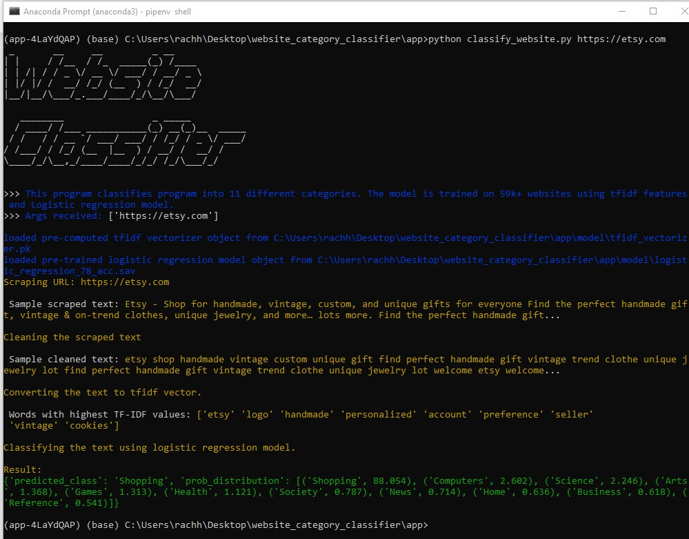
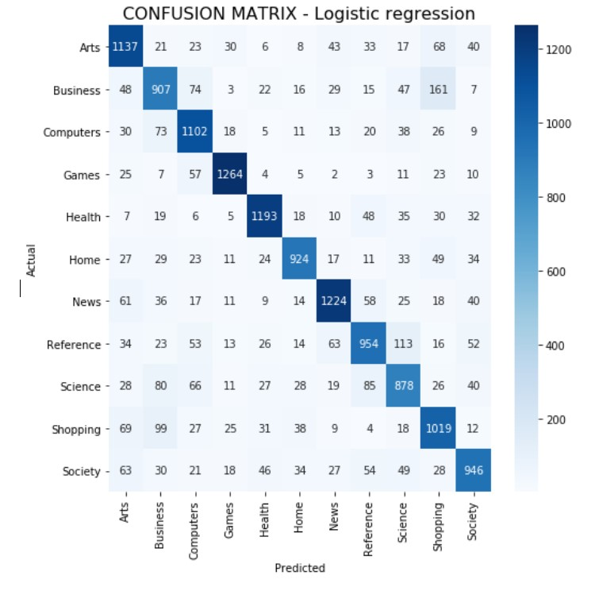

# Website classification based on text content

This project can classify a website from 11 different labels based on the text and metadata content of the website. The machine learning model used for classification is Logistic Regression. It was trained on the text and metadata content from 59K+ websites using TF-IDF features after basic text pre-processing. Accuracy of 77.9 % was achieved.The labels are :

- Arts
- Business
- Computers
- Games
- Health
- Home
- News
- Reference
- Science
- Shopping
- Society

# Setup and use

Clone the repository

```sh
$ git clone https://github.com/rachhek/website_classifier_app.git
$ cd website_classifier_app
```

Create a virtual environment and install the dependencies

```sh
$ pipenv shell
$ (website_classifier_app) pipenv install
```

Once the pipenv has finished installing all the dependencies, you can use classify_website.py to classify a website as follows:

```sh
$ (website_classifier_app) python classify_website.py https://etsy.com
```

Sample result

```json
{
  "predicted_class": "Shopping",
  "prob_distribution": [
    ("Shopping", 89.578),
    ("Society", 2.086),
    ("Arts", 1.415),
    ("Computers", 1.15),
    ("Home", 1.11),
    ("Science", 1.068),
    ("Games", 0.932),
    ("Health", 0.711),
    ("Business", 0.69),
    ("Reference", 0.662),
    ("News", 0.598)
  ]
}
```

Result explanation

```
"predicted_class" : The class that was predicted.
"prob_distribution" : The probability distribution (in precentage) of the 11 classes for this website.
```

App Screenshot



# Dependencies

The major dependencies are as follows.

- pandas
- beautifulsoup4
- sklearn
- requests
- spacy

Check pipfile for details

# Files and folders

```
- "./jupyter_notebooks" : contains Jupyter notebooks for code used for scraping the 59k+ websites, data preprocessing, data exploration, model creation and parameter tuning.
- "./model" : contains the tf-idf vectorizer file and trained logistic regression model
- "./classify_website.py" : the py file containing the main function
- "./lib.py": the py file containing the classes for scraper, text pre processing and prediction
- "./pipfile": file containing the dependencies for this pip environment.
```

# Model Training Details

## Dataset collection

The dataset used is : https://www.kaggle.com/patanjalichin1/dmoztoolsnet-categorical-data

- Has 800K+ labelled websites with Major and sub categories.
- 11 Major categories : Arts, Business, computers, games, health, home, news, reference, science, shopping, society.
- For this project, only 5500 websites per category were collected (Total of 59K+ websites)
- Check ./jupyter_notebook/dmoz_dataset_exploration.ipynb and ./jupyter_notebook/dataset_creation.ipynb for details

## Website scraping

- <b>Requests</b> was used to download the website content and <b> Beautifulsoup</b> was used to parse the website
- Title tags, Meta tags, heading tags and text content from the website was collected along with the count of html tags.
- Check ./jupyter_notebook/dataset_creation.ipynb for details

## Text preprocessing

- Spacy library was used to remove the stopwords, lemmatize the words and other unneccesary stuff.
- Check ./jupyter_notebooks/data_preprocessing_and_exploration.ipynb for details

## Feature engineering and Model Training

- TF-IDF features was created using sklearn\s TfidfVectorizer
- Sklearn's logistic regression was used to train the model. Other models like Naive Bayes, Neural networks (LSTM RNN) were also used but the accuracy didn't improve significantly and the size of the model was also huge (100mb+). Thus, I decided to stick with logistic regression model because it gave me lightweight model and equally good accuracy as others.
- Sklearn's gridsearch was used to tune the parameters.
- Model has accuracy of 77.9%
- Check ./jupyter_notebooks/classification_using_logistic_regression.ipynb for details
- The confusion matrix is as follows:  
  

## Findings

The model is very good at classifying website categories related to Games, health and news. However, it seems high number of incorrect predictions are as follows:

- Business websites being predicted as Shopping(161)
- Reference websites being predicted as Science(113)
- Shopping websites being predicted as Business (99)
- Science websites being predicted as Business(80)

## Future Ideas

- The dmoz dataset has lots of sub-categories for every main category. This can be used to train the model that can classify even more classes.
- Neural network models work better when there are lot of training data. If we can scrape all 800K websites from the dmoz dataset and used it to train the model, then the accuracy might improve
- During the scraping process, I have also scraped all the HTML tags and their frequency of occurance. This data could be used as features to train models.

## References

- http://www.ijcte.org/vol9/1180-IT026.pdf
- https://towardsdatascience.com/multi-class-text-classification-with-scikit-learn-12f1e60e0a9f
